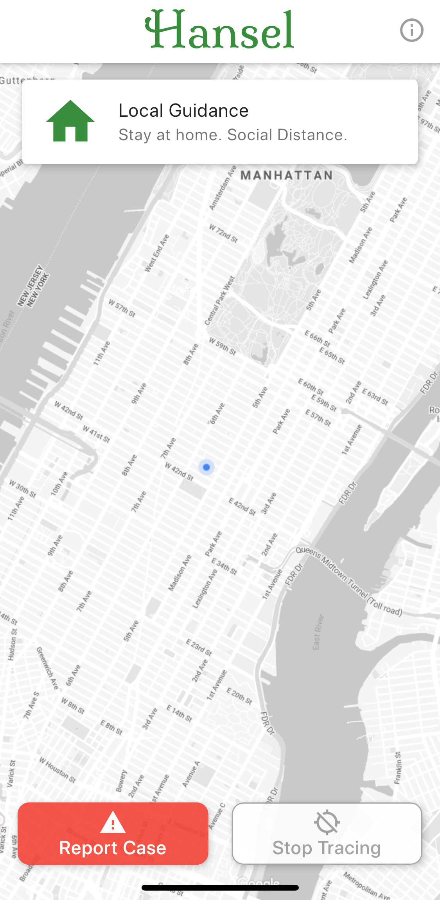

# What is Hansel?

Hansel is a **privacy preserving**, **open source**, **contact tracing** application created to slow the spread of COVID-19.

## What is contact tracing and why is it helpful?
Contact tracing slows the spread of a virus by alerting people (contacts) to likely exposures. Those contacts can then alter their behavior (through testing and self-quarantining) to reduce the likelihood they infect others.

## How do you preserve privacy while contact tracing?
Your location data never leaves your phone, and we never know your name. The app uploads a [hash](https://en.wikipedia.org/wiki/Cryptographic_hash_function) of where you were and at what time, which lets us match you to other people that have crossed your path. When someone self-reports a COVID-19 diagnosis we alert any other users with matching location hashes. Only those users can see the locations where they've been exposed and can decide to get tested or self-quarantine.

## What about other contact tracing apps?
Hansel's goal is to bring privacy preserving contact tracing to as many communities as possible. Our privacy preserving algorithm is open sourced and we are happy to integrate with any other apps. If another app takes hold that retains our users' privacy, we'll direct our users to adopt that app.

## How do we know you aren't using our data for other purposes?
The source code for the app and backend services are open source for all to see and the app is run by a non-profit. If there's any code that is concerning, please reach out.

## What if a government seizes Hansel's data?
Hansel only stores a hash of your location, it cannot be reverse engineered. Even if we wanted to provide a government with a specific user's location, we couldn't. We couldn't even tell them who uses the app.

## What about fraudulent reports?
We will initially review all reports by hand. As we have more data, we'll be able to determine the likelihood that a report is fraudulent. In those cases we will request further confirmation.

## Why Hansel?
Hansel and Gretel is a classic German fairy tale. Hansel (the protagonist) uses pebbles as a way of ensuring he and his sister stay safe while walking in the forest. Hansel (the app) tracks location in a similarly anonymous way to keep you and your community safe from COVID-19.
